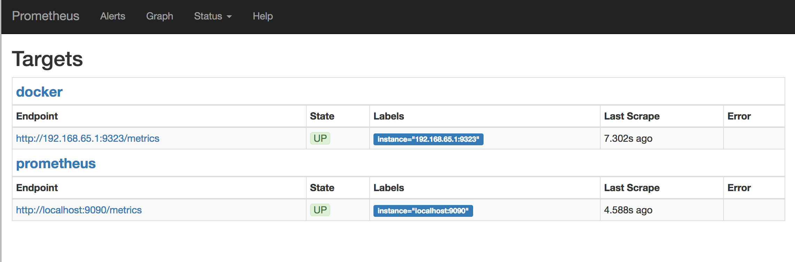

Maintenant que nous avons une architecture distribuée qui sert notre application, nous allons nous intéresser à sa [supervision](https://www.it-connect.fr/monitoring-supervision-et-metrologie/). On souhaite savoir comment notre système se comporte à l'instant T, et à emettre de alertes en fonction des évènements.

## Partie I - Émulation de clients

Pour que l'exercice ne soit pas trop ennuyeux, on va commencer par émuler des clients se connectant à nos services, et réalisant des opérations de lecture, d'ajout, et de suppression d'images.

Pour ce faire, nous utiliserons [Pupeteer](https://pptr.dev/), qui est un "navigateur sans tête" (*headless browser*) Chromium. Il se pilote en Javascript.

1. Lire [la documentation de Pupeteer](https://pptr.dev/) et réaliser un service qui prenne unu capture d'écran de votre galerie et le sauvegarde.

2. Réaliser un utilisateur émulé qui se promène sur plusieurs galeries avant de quitter votre site. Idéalement, il cliquera aussi sur vos photos pour les agrandir (ce qui changera de beaucoup le traffic si vous aviez créé des miniatures de vos images).

3. Créer un utilisateur qui ajoute une galerie/image (en fonction de ce que vous avez implémenté), et qui se déconnecte.

4. Créer un utilisateur qui supprime une image d'une de vos galeries et se déconnecte.

5. Réaliser un dernier utilisateur qui :

	* Ajoute une image avec une probabilité d'1/10 ;
	* Supprime une image avec une probabilité d'1/10 ;
	* Se promène sur le site avec une probabilité de 8/10.

6. Ajouter ce service à votre swarm.

## Partie II - Monitoring avec Prometheus

[Prometheus](https://prometheus.io/) est une solutions de monitoring qui s'interface bien avec Docker. On va l'installer sur notre swarm en suivant [ce tutoriel Docker](https://docs.docker.com/config/thirdparty/prometheus/).

1. Avec Ansible, créer le fichier `/etc/docker/daemon.json` contenant les lignes suivantes :

		{
		  "metrics-addr" : "0.0.0.0:9323",
		  "experimental" : true
		}

	Pour appliquer les modifications de vos playbooks Ansible sans redémarrer vos machines, vous pouvez lancer `vagrant up --provision`. Cela rejouera les playbooks en modifiant seulement le minimum.

2. Dans une des VMs, tester le bon fonctionnement des métriques Docker avec une commande comme :

		curl http://localhost:9323/metrics 

	Enregistrer le dump, et interprêter ce qu'il contient.

3. Finir le déployment de Prometheus en suivant [le tutoriel](https://docs.docker.com/config/thirdparty/prometheus/) jusqu'à ce que ça fonctionne (image prise du tutoriel) :

4. Ajout d'alertes -- à discuter en cours.

## Pour aller plus loin

Lors du prochain TD, nous créerons notre propre outil de monitoring en Node. Plusieurs outils existent, et nous pouvons nous intéresser à différents aspects (alertes ou visualisation). Commencer à vous renseigner sur les outils et sur la visualisation de données en Javascript.

